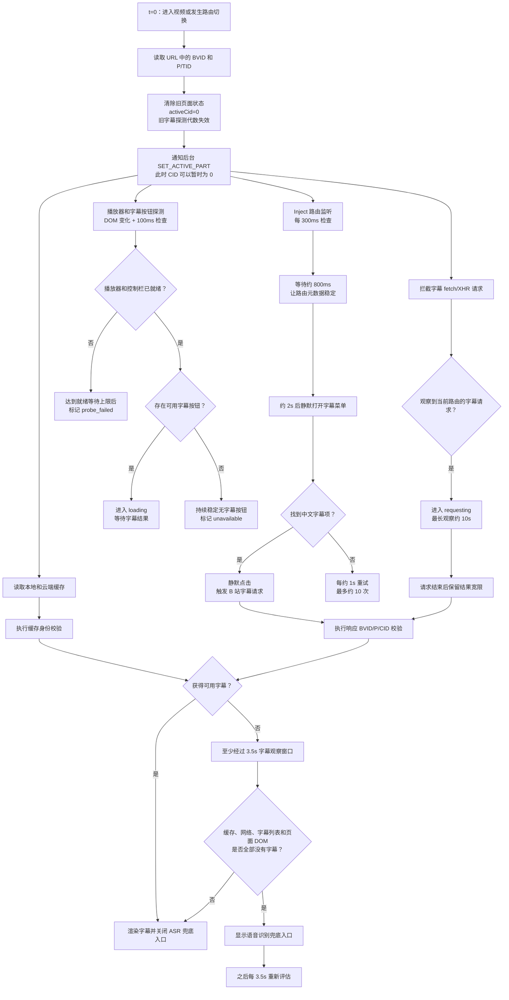
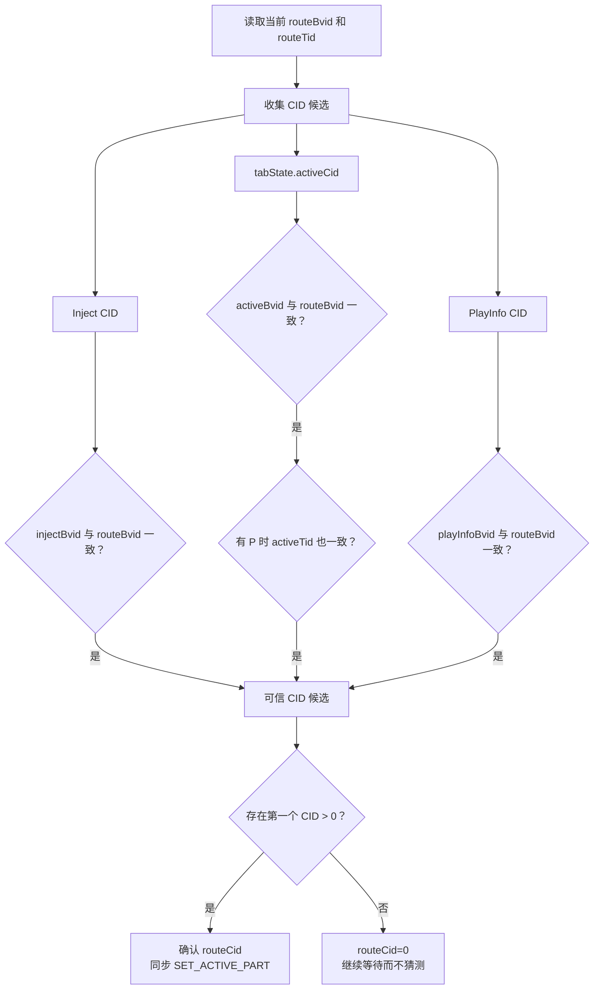
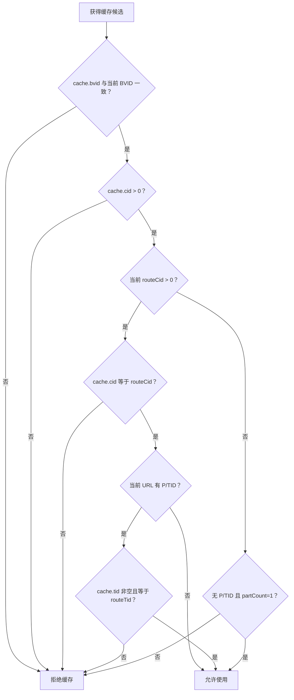
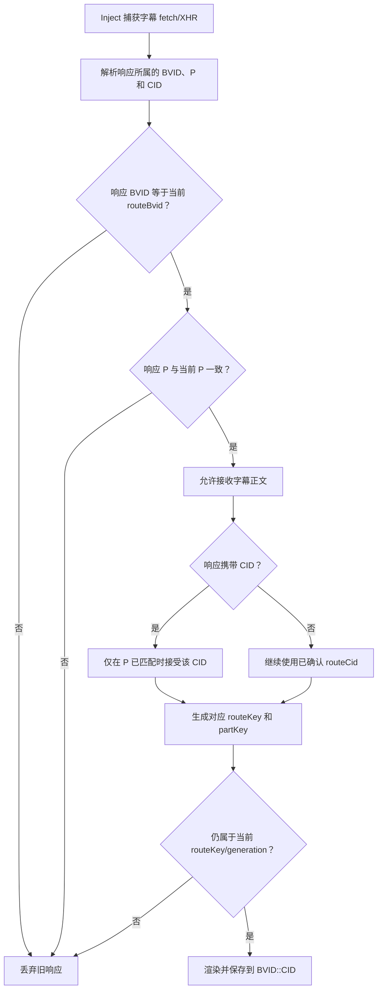
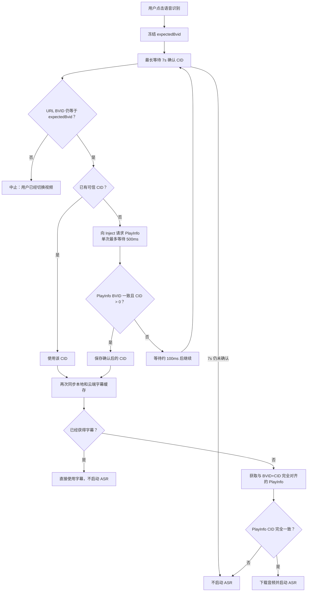
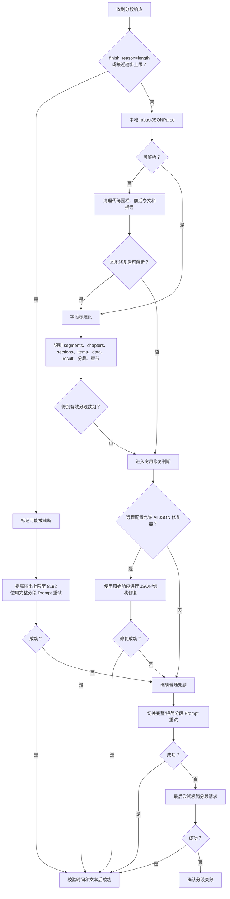

# Bilitato 字幕探测与 AI 任务流程

本文档说明 Bilitato 从进入 B 站视频页面开始，到字幕探测、缓存读取、语音识别兜底、总结与视频分段生成的完整流程，并记录 v1.5.0 到 v1.6.0 的主要变化。

> 说明：文中的定时任务多数并行运行，不应把所有等待时间简单相加。网络请求和模型生成耗时还会受到网络、Provider 排队及模型速度影响。

## 1. 核心身份概念

| 字段 | 含义 | 用途 |
| --- | --- | --- |
| `BVID` | B 站视频 ID | 标识视频稿件 |
| `P/TID` | 当前分 P 的路由参数 | 识别页面当前所在分 P |
| `CID` | B 站视频分 P 的内容 ID | 隔离不同分 P 的字幕、总结和分段 |
| `partCount` | 视频分 P 数量 | 判断是否为明确的单 P 视频 |
| `routeKey` | `BVID + P/TID` | 隔离页面切换前后的字幕探测状态 |
| `partKey` | `BVID::CID` | 本地缓存和任务结果的分 P 存储键 |
| `generation` | 本轮字幕探测代数 | 让旧路由的异步结果自动失效 |
| `taskContext` | 冻结的任务身份 | 保证 AI 任务执行期间不受切 P 影响 |

整个身份链路为：

```text
页面身份：BVID + P/TID
        ↓
播放身份：BVID + CID
        ↓
任务身份：taskContext(BVID + CID + TID)
        ↓
缓存身份：parts[BVID::CID]
```

## 2. 字幕探测总流程



## 3. CID 获取与确认

当前 CID 不是从状态中无条件取值，而是分别校验来源。



### 3.1 切换视频或分 P

切换路由时会立即：

1. 更新 `routeKey`；
2. 将 `activeCid`、`injectCid` 和 `partCount` 暂时清零；
3. 增加字幕探测 `generation`；
4. 清除当前展示的字幕行；
5. 通知后台当前分 P 尚未确认；
6. 重新请求 PlayInfo 和字幕。

旧请求返回时，如果其 `routeKey` 或 `generation` 不再匹配当前页面，结果会被忽略。

## 4. 缓存读取规则



规则总结：

- 多 P 视频必须准确匹配 `BVID + CID`；存在 TID 时还必须匹配 TID。
- 明确的单 P 视频在路由 CID 暂时为空时，可以使用同 BVID 下带有效 CID 的缓存。
- 无法确认是否单 P 时不使用不确定缓存，避免内容串线。
- 云端优先精确查询 `BVID + CID`。
- 只有 `partCount=1` 时，云端才允许兼容 `BVID 相同且 CID 为 NULL` 的旧缓存记录。

## 5. 字幕网络响应校验



## 6. 语音识别兜底

语音识别必须取得已确认的 CID，不能只凭 BVID 下载音频。



ASR 任务超时上限约为 120 秒。7 秒只用于确认当前 CID，不是 AI 总结任务的固定等待。

## 7. 总结与视频分段任务

```mermaid
flowchart TD
    A["用户点击生成总结"] --> B{"已有同类任务执行中？"}
    B -- "是" --> X["忽略重复点击"]
    B -- "否" --> C{"当前缓存有有效字幕？"}
    C -- "否" --> D["重新同步缓存<br/>最多 3 次，间隔约 120ms"]
    D --> E{"同步后获得字幕？"}
    E -- "否" --> Y["提示暂无字幕，不发送 AI 请求"]
    E -- "是" --> F["冻结 taskContext"]
    C -- "是" --> F

    F --> G["冻结 BVID、CID、TID、partCount 和视频时长"]
    G --> H{"CID > 0？"}
    H -- "否" --> Z["PART_IDENTITY_PENDING"]
    H -- "是" --> I["后台再次选择 parts[BVID::CID]"]
    I --> J{"缓存身份与 taskContext 一致？"}
    J -- "否" --> Y
    J -- "是" --> K{"调用模式"]

    K -- "质量模式" --> L["总结和分段分别请求<br/>并行等待"]
    K -- "省流模式" --> M["一次组合流式请求<br/>同时生成总结和分段"]

    L --> N["总结非空校验"]
    L --> O["分段 JSON/字段校验"]
    M --> P["先识别 SUMMARY 区块<br/>可提前显示总结"]
    P --> N
    P --> O

    N --> Q{"总结非空？"}
    Q -- "是" --> R["保存总结到当前 partKey"]
    Q -- "否" --> S["沿用原请求方式重试 1 次"]
    S --> T{"重试后非空？"}
    T -- "是" --> R
    T -- "否" --> U["SUMMARY_EMPTY_RESPONSE"]

    O --> V{"分段结构有效？"}
    V -- "是" --> W["保存分段到当前 partKey"]
    V -- "否" --> AA["进入分段修复链"]

    R --> AB["汇总最终任务状态"]
    U --> AB
    W --> AB
    AA --> AB
    AB --> AC{"最终结果"}
    AC -- "全部成功" --> AD["task_success"]
    AC -- "只成功一项" --> AE["task_partial<br/>保留成功结果"]
    AC -- "全部失败" --> AF["task_failed<br/>最终仅捕获一次 Sentry"]
```

### 7.1 模式差异

- **质量模式**：总结与分段是两个独立请求，通常并行执行；其中一个失败不会删除另一个成功结果。
- **省流模式**：总结与分段放在一次组合请求中；总结区块先完整返回时可以先展示，分段继续处理。
- 普通 AI 请求单次超时约为 60 秒，省流组合任务整体上限约为 120 秒。

## 8. 分段 JSON 修复链



## 9. v1.5.0 与 v1.6.0 的字幕探测差异

| 逻辑 | v1.5.0 | v1.6.0 |
| --- | --- | --- |
| 底层探测 | 已有静默触发、网络拦截和缓存探测 | 保留原方案并强化上层协调 |
| UI 状态 | 多个布尔值和定时器分别控制 | 新增 `probing/loading/requesting/ready/unavailable/probe_failed` 状态机 |
| 页面隔离 | 已有 BVID/P 路由检查 | 新增 `routeKey + generation`，旧异步结果失效 |
| CID 来源 | 从 Inject、tabState 取第一个有效值 | 对 Inject、tabState、PlayInfo 分别验证 BVID/TID |
| 缓存身份 | CID 缺失时判断相对宽松 | 强制有效 CID，按 `BVID::CID` 隔离 |
| 单 P 兼容 | CID 暂时缺失时容易无法明确处理 | `partCount=1` 时允许读取对应缓存 |
| ASR 身份 | 可能直接使用已有状态 CID | 最长等待 7 秒确认 BVID 对应 CID |
| 用户手动字幕操作 | 自动流程可能继续运行 | 当前路由检测到手动操作后停止静默干预 |

### 9.1 保持不变的基础时间

| 环节 | v1.5.0 和 v1.6.0 |
| --- | ---: |
| 首次字幕检查延迟 | 1 秒 |
| 常规字幕检测超时 | 5 秒 |
| ASR 兜底观察窗口 | 3.5 秒 |
| 静默触发字幕菜单 | 约 2 秒 |
| Inject 路由检查 | 每 300ms |
| 路由元数据稳定等待 | 约 800ms |

### 9.2 v1.6.0 发布版新增状态机时间

| 环节 | v1.6.0 发布版 |
| --- | ---: |
| 播放器尚未就绪最长观察 | 2 秒 |
| 控制栏就绪但无字幕按钮 | 稳定 500ms 后判定 |
| 找到字幕按钮后的结果宽限 | 500ms |
| 字幕请求最长观察 | 10 秒 |
| 请求结束后的结果宽限 | 1.5 秒 |
| ASR 前确认 CID | 最长 7 秒 |

### 9.3 当前开发分支的后续调整

当前开发分支已经进一步放宽部分探测时间，以降低慢加载环境中的误判：

| 环节 | v1.6.0 | 当前开发分支 |
| --- | ---: | ---: |
| 无字幕按钮稳定窗口 | 500ms | 3 秒 |
| 找到字幕按钮后的宽限 | 500ms | 5 秒 |
| 播放器就绪等待 | 2 秒 | 8 秒 |
| 请求结束后的宽限 | 1.5 秒 | 5 秒 |

## 10. 代码位置

- `content.js`：字幕 UI 状态、路由/CID 校验、缓存应用、ASR 入口和 AI 任务发起。
- `inject.js`：播放器 PlayInfo、字幕菜单静默触发、fetch/XHR 字幕捕获和路由监听。
- `background.js`：分 P 缓存目录、云缓存、AI 总结/分段任务及重试。
- `utils/supabaseClient.js`：Supabase REST/RPC 请求和超时控制。

v1.5.0 到 v1.6.0 的字幕相关变化主要分布在以下提交：

- `499046d`：稳定路由切换后的字幕渲染。
- `a238119`：稳定分 P 切换时的字幕加载。
- `0467649`：简化字幕兜底诊断逻辑。
- `9884848`：隔离多 P 缓存并稳定字幕状态。
- `5d28ef1`：恢复单 P 云缓存兼容。
- `4524fbe`：稳定字幕控制项探测。
